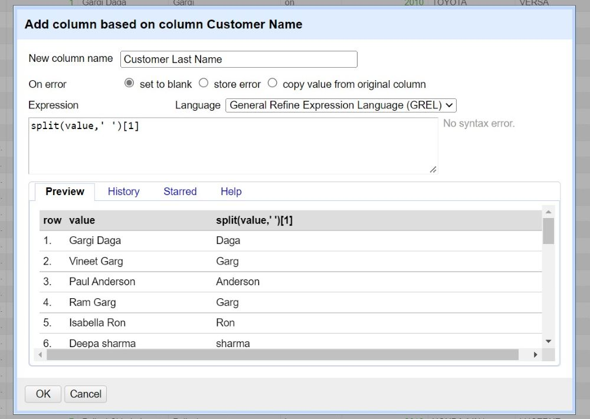
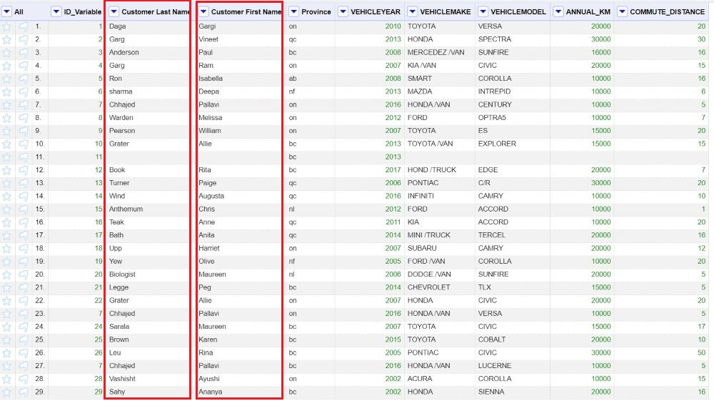
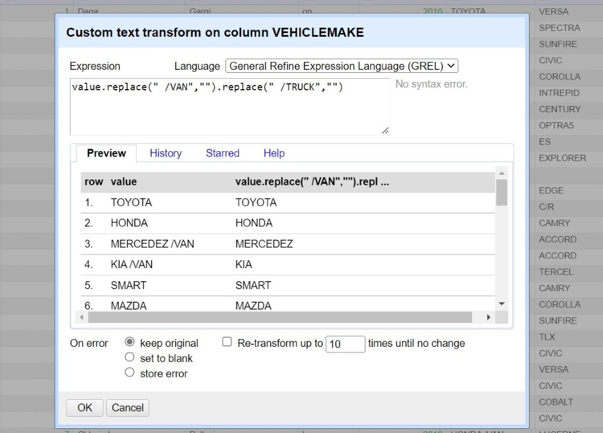
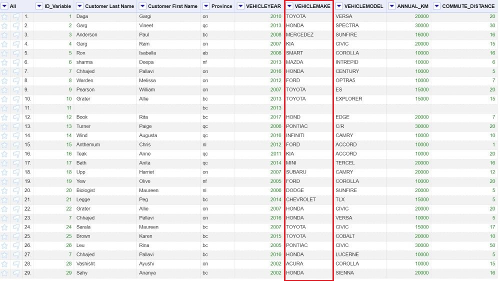
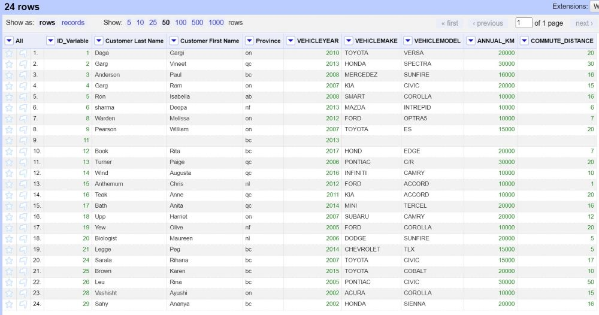
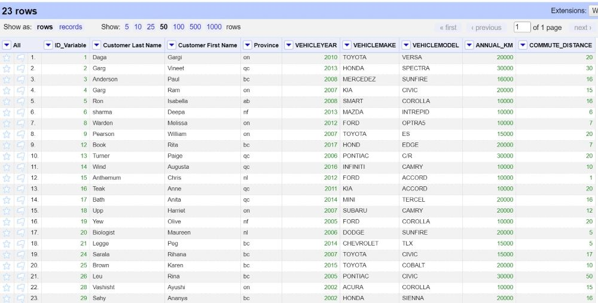
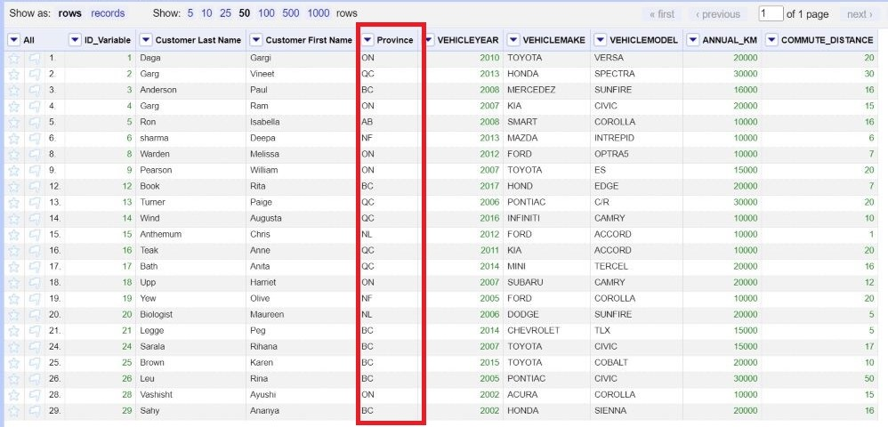
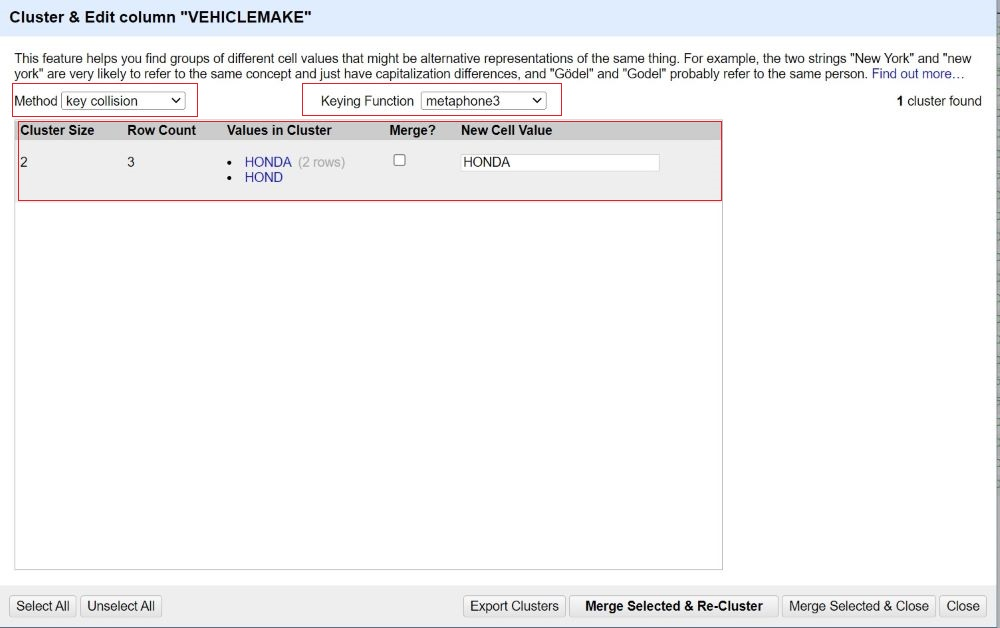
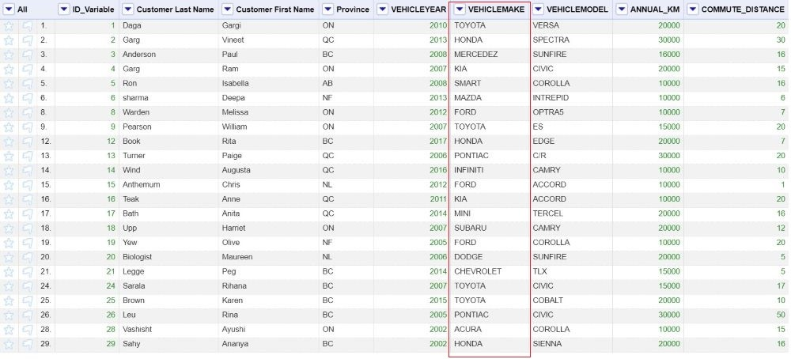

# 1.Introduction to Open Refine

Open Refine is an open-source desktop application for data cleanup and transformation to other formats, an activity commonly known as data wrangling. It is similar to spreadsheet applications, and can handle spreadsheet file formats such as CSV, but it behaves more like a database.

----

# 2.Setup Instructions
In preparation for this module, you will need to download and unzip the Open Refine package. The steps to do this are:

* Go to the [downloads page for Open Refine](https://openrefine.org/download.html)
* Click the Highlighted text that represents your operating system (If you are using windows and are unsure if you have java, choose the option that comes with Java)
* Save the file to your computer in a location that you have access to
* Unzip the file using your preferred zipping tool (right click on the folder and choose the program to unzip with like 7zip or WinZip).
* (Optional) Make a shortcut on your desktop by opening the folder, right clicking openrefine.exe (blue gem symbol) and clicking "create shortcut" (you may need to move the new shortcut to your desktop manually depending on your operating system).
* After you launch Open Refine by double clicking on the blue gem icon, it will open a black dialogue box with codes and it should automatically open a new browser window. (Note: Open Refine doesn’t operate as a desktop application, but instead uses a browser window. A black dialogue box needs to remain open for the period you are using Open Refine.)

You will also need to download the dataset for the module by clicking [HERE](https://github.com/BrockDSL/Step-by-Step-guide-to-Open-Refine/raw/master/Open%20Refine%20Data%20Set.xlsx)

----

# 3.What are Data Types?

Data in Open Refine is auto-sorted into different data types. Since each data type has some slightly different functionality, you may want to understand each data type and its usage. Data type is an attribute associated with a piece of data that tells a computer system how to interpret its value. Understanding data types ensures that data is collected in the preferred format and the value of each property is as expected. Please click on the headings below to expand the title and learn more about the different data types.

<iframe src="https://h5pstudio.ecampusontario.ca/h5p/42564/embed" width="993" height="537" frameborder="0" allowfullscreen="allowfullscreen"></iframe>

----

## 3.1.Take quiz to test your knowledge of Data Types.

<iframe src="https://h5pstudio.ecampusontario.ca/h5p/42567/embed" width="993" height="449" frameborder="0" allowfullscreen="allowfullscreen"></iframe>

----

# 4.Now let’s practice cleaning some data.

Almost every dataset you’ll encounter will be messy. Inconsistencies in how data is entered, such as misspellings, extra spaces, and unknown values, can make the data difficult to analyse later. It’s important to clean your data before trying to use it in any way. In this module, we’ll learn how to clean up inconsistent data with a powerful program called OpenRefine.

The dataset that will be used in this module details data collected by an imaginary car insurance company.  The data is still raw and thus needs to be cleaned up by fixing incorrect values, dealing with missing values, and removing values that are not important for the analysis we want to do. Our job is to remove the erroneous values and improve the quality of the data by using Open Refine. 

The following is the description of each variable:

| Variable | Definition |
| ----------- | ----------- |
| ID_VARIABLE | Identification Number |
| CUSTOMER NAME | Name of the customer |
| PROVINCE | Place the client is located |
| VEHICLEYEAR | Year of the vehicle |
| VEHICLEMAKE | Make of the vehicle |
| VEHICLEMODEL | Vehicle Model |
| ANNUAL_KM | The number of kilometers the client drives on an annual basis provided by the client |
| COMMUTE_DISTANCE | Distance of the client’s commute from their home to their place of work provided by the client (in kilometers) |

----

**Step 1: Create a project**

* In OpenRefine, navigate to the menu on the left-hand side of the browser and select the “Create Project” tab. Choose the data file we downloaded during set up instructions. 
* Click "Next". The next screen you’ll see is a preview screen. This shows you how OpenRefine sees your data and allows you to change settings before you import it. We’ll leave the settings as it is for this module.
* Now hit the “Create Project” button on the top right hand side of the screen to finish importing.

 
 
* You will see your project has been created. 
* To see more of the data, change the number of rows shown by changing the settings at the top of the screen to show **50** rows instead of the default 10.

**Rows** display your data in individual lines, each numbered separately, while **Records** display your data in multi-line groupings depending on the relationships between the data in those lines.

  
 
 ----

**Step 2: Using GREL**

GREL, or General Refine Expression Language, is a language used to work with and manipulate data, cells, and columns in OpenRefine. GREL can be utilized in a number of places in OpenRefine including:

* Adding a column based on another column.
* Adding a column by fetching URLs.
* Transforming cell contents.
* Creating custom facets (both number and text).

*NOTE: GREL is case-sensitive, meaning that (for example) "Match" and "match" will not produce the same result.*

**<ins>Let's use GREL to clean our data</ins>**

We will add another column using the “Customer Name” column. We will extract the first name and last name of the customer. To do that, we use the “General Refine Expression Language (GREL)” to implement splitting. Splitting works in the following way:-

**value.split(";")[0]**

The first part (value.split(";")) will split the value into an array (list) using a semicolon as the character to split it up. The [0] directs OpenRefine to take the first item from the list created by the 'split' command. (and using [1] instead would take the second value, [2] the third, etc.)

Please follow the below-mentioned procedure to add columns using split string:-

* Go to the “Customer Name” Column. Click on the small triangle at the column name. Use “Edit Column” -> “Add column based on this column”.
* A dialogue box will appear. Under the new column name, type: **Customer First Name**. 
* Make sure, "On error" is **set to blank**.
* Under the expression type: <mark> split(value,'')[0]</mark>

* Press “OK”
* You will see the new column name, **Customer First Name** is added right next to the “Customer Name” column. 
* Repeat first 2 procedures, but for the new column name, type: **Customer Last Name**. 
* Under the expression type: <mark>split(value,' ')[1]</mark>

* Press “OK”
* You will see the new column name, **Customer Last Name** is added right next to the “Customer Name” column. 
* To remove the column “ Customer Name”, click on the small triangle on "Customer Name" column. Select "Edit Column" -> "Remove this column" option. The " Customer Name" column will be removed. 

Now we will see use another method to transform the data using GREL. You will see many values under the “VEHICLEMAKE” column which have */TRUCK and /VAN* along with its brand. We don't want those values, so we will remove the /TRUCK and /VAN values from the cells by transforming the cell contents using GREL's replace command.” Replace command works in the following way:-

**value.replace('cat’, ‘dog')**

In this case, the values of the current column will be searched for the string ‘cat’ which will be replaced by the string ‘dog’.

GREL includes a specific vocabulary for referring to cell values:

* value = the values in the current column.
* cells['Column2'].value = the values in the specified column, ‘Column2’
* A string can be written with either single or double quotation marks.

Please follow the below-mentioned procedure to replace all of the instances of /Truck and /Van with nothing:-

* Go to column name “VEHICLEMAKE”
* Select “Edit Cell” -> “Transform” option. 
* A dialogue box will appear to write the GREL statement. Type or paste-  <mark>value.replace(" /VAN","").replace(" /TRUCK","") </mark> and press OK.

* You will see your column “VEHICLEMAKE” has been transformed. 

----

**Step 3: Using Facets**

A *‘Facet’* groups all the values that appear in a column, and then allows you to filter the data by these values and edit values across many records at the same time. There are different kinds of facets such as text facet, numeric facet, timeline facet, scatterplot facet, and customize facet. 

 

* **Text facets** group all the text values in a column and lists each value with the number of records it appears in. The facet information always appears in the left-hand panel in the OpenRefine interface.

* **Numeric** and **Timeline facets** display graphs instead of lists of values. The graph includes ‘drag and drop’ controls you can use to set a start and end range to filter the data displayed.

* **Scatterplot facets** display a visual representation of two related sets of numeric data.

* **Custom facets** are a range of different types of facets. Some of the default custom facets are:

    * Word facet - This breaks down text into words and counts the number of records each word appears in.

    * Duplicates facet - This results in a binary facet of ‘true’ or ‘false’. Rows appear in the ‘true’ facet if the value in the selected column is an                    exact match for a value in the same column in another row.

    * Text length facet - It creates a numeric facet based on the length (number of characters) of the text in each row for the selected column. This can                  be useful for spotting incorrect or unusual data in a field where specific lengths are expected (e.g. if the values are expected to be years, any                     row with a text length more than 4 for that column is likely to be incorrect).

    * Facet by blank - A binary facet of ‘true’ or ‘false’. Rows appear in the ‘true’ facet if they have no data present in that column. This is useful                    when looking for rows missing key data.

**<ins>Let's create a Facet.</ins>**

<ins>We will first create a facet for duplicate values.</ins>

* Go to the “Customer First Name” Column.  
* Click on the small triangle at the column name. Use “Facet” -> “Customized facets” -> “Duplicates facet”. We could see in the left-hand panel, that there are 5 duplicate items ( true)  in the “Customer First Name” column. 
* Click on **true** to see the duplicates. 

 
 
* Go to the column name "All". 
* Click on the small triangle at the column name. Use "Edit rows" -> "Remove matching rows".
* All the duplicate values will be removed.
* On the left-hand side panel, click on the "Remove All" button to close the facet. 
* You will see 24 rows. We will use these 24 rows to further clean up our data.

  
  
 <ins>Now we will create facet for missing values.</ins>
 
We may want to remove the “bad values” or the “outliers”. Outliers are observations that are very different from the majority of the observations in the data set. Missing values are outliers in our data set.

* Go to the “Customer First Name” Column.  
* Click on the small triangle at the column name. Use “Facet” -> “Customized facets” -> “Facet by blank”, we could see a panel on the left-hand side, with a true and false value.  
* Click on **true** to see the rows with missing values. 
* Go to the column name "All". 
* Click on the small triangle at the column name. Use "Edit rows" -> "Remove matching rows".
* One row with the missing values will be removed.
* On the left-hand side panel, click on the "Remove All" button to close the facet. 
* You will see 23 rows. We will use these 23 rows to further clean up our data.

----

**Step 4: Common transforms**

OpenRefine features several functions for performing commonly needed transformations to your data. Many of these transformations are intended for data cleaning purposes and can also be done by using regular expressions. Common transforms just serve as shortcuts; in reality, GREL commands are being run on the cells in a manner similar to that which was accomplished in the previous stage using the "Transform" tool in **Step 2**. 
For quick reference, consult the list of transformations and their function below:-

| Transformation | Function |
| ----------- | ----------- |
| Trim leading and trailing whitespace| Removes extra spaces before and after the value in each cell in the selected column.|
| Collapse consecutive whitespace| Removes extra spaces between individual strings within a cell value in the selected column.|
| Unescape HTML entities | Removes HTML strings indicating particular characters (e.g., “&” vs “&amp;amp;”).|
| Replace Smart quotes with ascii | Replaces Smart quotes to their ASCII (e.g., ' and ")|
| To titlecase | Changes the first letter of all words within a cell value to an uppercase letter.|
| To uppercase| Changes all letters of all words within a cell value to uppercase letters.|
| To lowercase | Changes all letters of all words within a cell value to lowercase letters.|
| To number | Changes the cell format to number.|
| To date | Changes the cell format to date.|
| To text | Changes the cell format to text.|
| To null| Changes the cell format to null.|
| To empty string | Changes the cell format to an empty string.|

**<ins>Let’s use common transforms</ins>**

* Go to column “Province”, Click on the small triangle at the column name.
* OpenRefine allows for easy transformation by providing a set of functionalities under “Edit cell” -> “Common transforms”.
* Select **to uppercase** to make all the provinces in the capital.

----

**Step 5: Clustering**

Clustering is defined in OpenRefine as "finding groups of different values that may be alternative representations of the same thing." OpenRefine goes through the data in the column you’ve selected and uses algorithms to try to recognize values that might be variations of the same thing. It then allows you to group or merge them together under one consistent name of your choosing.
Mentioned below are the two types of algorithms supported by OpenRefine:

* Key collide: The purpose of "Key Collision" methods is to generate a different representation of a value (a "key") that only includes the meaningful portion of the string when their keys coincide (hence the name "key collision"). There are six main collision techniques: the fingerprint, the n-gram fingerprint, the metaphone 3, the cologne phonetics, the Daitch-Moktoff, and the Beider-Morse.

* Closest neighbor: Under Closest Neighbor techniques (otherwise called kNN), any sets of strings that are nearer than a specific worth will be binned together.

**<ins>Let’s  use clustering</ins>**

* Go to the column “VEHICLEMAKE” and click the arrow button on the column header, then select the “Edit cells” option and choose “Cluster and edit.”
* A clustering window will open. In the Clustering window, you will see following options:-

    - At the top of the window is where you can choose the type of algorithm to run.
    - In the center of the window is a list of the suggested clusters, the current values, and suggested new value.
* Go to the **Method** option and click on the downward arrow. A drop-down menu will open. From the drop-down menu, select “key collision”.
* Go to the **Key Function** option and click on the downward arrow. A drop-down menu will open. From the drop-down menu, select “metaphone3”. 

* You will see a cluster for HONDA and HOND. The HOND is misspelled, and it should have been HONDA instead of HOND. 
* Select the “Merge?” box and confirm that the text box in the “New Cell Value” column is HONDA. 
* When you are ready, select “Merge Selected & Close.” “Merge Selected & Close” edits the selected values and then closes out of the Clustering window. 

----

**Step 6: Export and share**

Finally, we have transformed a CSV format messy data into a nice table. We can export the resulting table into a variety of formats including Excel and use the “Permalink” in the left-upper part to share the workspace with others.

----

# 5.Resources
[Open Refine Manual](https://docs.openrefine.org/): The Open Refine manual is intended to walk you through every aspect of installing and using OpenRefine 3.5, including every interface function and feature.

----
  
**This module is brought to you by the Brock University Digital Scholarship Lab.  For a listing of our upcoming workshops go to [Experience BU](https://experiencebu.brocku.ca/organization/dsl) if you are a Brock affiliate or [Eventbrite page](https://www.eventbrite.ca/o/brock-university-digital-scholarship-lab-21661627350) for external attendees.  For additional inquiries, contact [DSL@Brocku.ca](mailto:DSL@Brocku.ca)**

