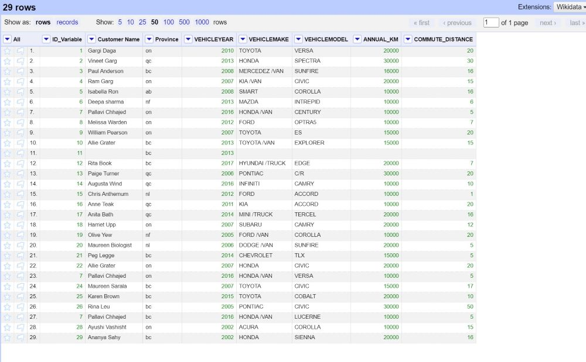
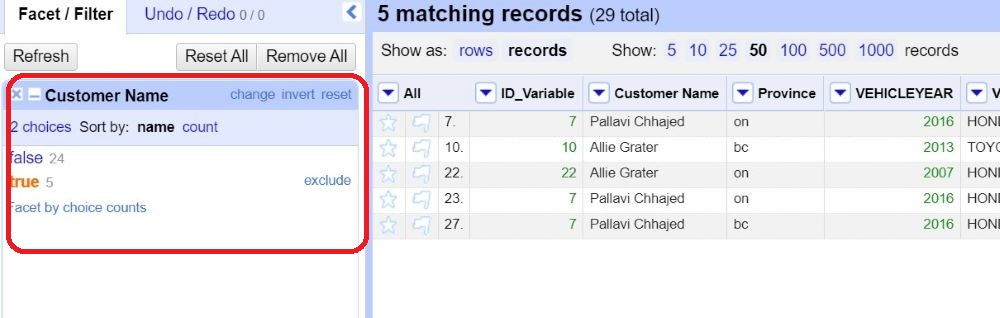
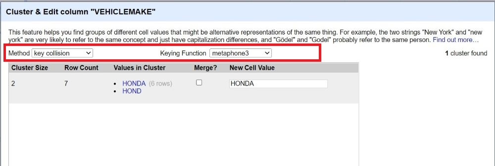

# 1.Introduction to OpenRefine

OpenRefine is an open-source desktop application for data cleanup and transformation to other formats, an activity commonly known as data wrangling. It is similar to spreadsheet applications, and can handle spreadsheet file formats such as CSV, but it behaves more like a database.

----

# 2.Setup Instructions
In preparation for this module, you will need to download and unzip the Open Refine package. The steps to do this are:

* Go to the [downloads page for Open Refine](https://openrefine.org/download.html)
* Click the Highlighted text that represents your operating system (If you are using windows and are unsure if you have java, choose the option that comes with Java)
* Save the file to your computer in a location that you have access to
* Unzip the file using your preferred zipping tool (right click on the folder and choose the program to unzip with like 7zip or WinZip).
* (Optional) Make a shortcut on your desktop by opening the folder, right clicking openrefine.exe (blue gem symbol) and clicking "create shortcut" (you may need to move the new shortcut to your desktop manually depending on your operating system).
* When you launch OpenRefine, First, it will open a black dialogue box with codes and it should automatically open a new browser window. (Note: OpenRefine doesn’t operate as a desktop application, but instead uses a browser window. A black dialogue box needs to remain open for the period you are using Open Refine.)

You will also need to download the dataset for the workshop by clicking [HERE](https://github.com/BrockDSL/Step-by-Step-guide-to-Open-Refine/raw/master/Open%20Refine%20Data%20Set.xlsx)

----
# 3.What are Data Types?

Data in OpenRefine is auto-sorted into different data types. Since each data type has some slightly different functionality, you may want to understand each data type and its usage. Data type is an attribute associated with a piece of data that tells a computer system how to interpret its value. Understanding data types ensures that data is collected in the preferred format and the value of each property is as expected. Please click on the headings below to expand the title and learn more about the different data types.

<iframe src="https://h5pstudio.ecampusontario.ca/h5p/42564/embed" width="993" height="537" frameborder="0" allowfullscreen="allowfullscreen"></iframe>
----

# 3.1.Take quiz to test your knowledge of Data Types. 

<iframe src="https://h5pstudio.ecampusontario.ca/h5p/42567/embed" width="993" height="449" frameborder="0" allowfullscreen="allowfullscreen"></iframe>

----
# 4.Now let’s practice cleaning some data.

Almost every dataset you’ll encounter will be messy. Often, there are inconsistencies in the way the data is entered has misspellings, extra spaces, and unknown values which can make the data difficult to analyze later. It’s important to clean your data before trying to use it in any way. In this module, we’ll learn how to clean up inconsistent data with a powerful program called OpenRefine.

The dataset that will be used in this workshop details data collected by an imaginary car insurance company.  The data is still raw and thus needs to be cleaned up by fixing incorrect values, dealing with missing values, and removing values that are not important for the analysis we want to do. Our job is to remove the erroneous values and improve the quality of the data by using Open Refine. 

The following is the description of each variable:

| Variable | Definition |
| ----------- | ----------- |
| ID_VARIABLE | Identification Number |
| CUSTOMER NAME | Name of the customer |
| PROVINCE | Place the client is located |
| VEHICLEYEAR | Year of the vehicle |
| VEHICLEMAKE | Make of the vehicle |
| VEHICLEMODEL | Vehicle Model |
| ANNUAL_KM | The number of kilometers the client drives on an annual basis provided by the client |
| COMMUTE_DISTANCE | Distance of the client’s commute from their home to their place of work provided by the client (in kilometers) |

**Step 1: Create a project**

* In your browser for the OpenRefine tab, choose to create a project from and select “This Computer” under the **Get data from** heading. 
* Choose the file “Open Refine Data Set” that we downloaded during setup instructions and Click on Next. 
* Click “Create Project”
 
 
* You will see your project has been created. 
* To see all 29 records, go to the top and click on **50** under "Show as" records.

 
 
 ---

**Step 2: Using Facet**

A *‘Facet’* groups all the values that appear in a column, and then allows you to filter the data by these values and edit values across many records at the same time. There are different kinds of facets such as text facet, numeric facet, timeline facet, scatterplot facet, and customize facet. 

 

* **Text facet** groups all the text values in a column and lists each value with the number of records it appears in. The facet information always appears in the left-hand panel in the OpenRefine interface.

* **Numeric** and **Timeline facets** display graphs instead of lists of values. The graph includes ‘drag and drops’ controls you can use to set a start and end range to filter the data displayed.

* **Scatterplot facets** display a visual representation of two related sets of numeric data.

* **Custom facets** are a range of different types of facets. Some of the default custom facets are:

1) Word facet - This breaks down text into words and counts the number of records each word appears in.

2) Duplicates facet - This results in a binary facet of ‘true’ or ‘false’. Rows appear in the ‘true’ facet if the value in the selected column is an                    exact match for a value in the same column in another row.

3) Text length facet - It creates a numeric facet based on the length (number of characters) of the text in each row for the selected column. This can                  be useful for spotting incorrect or unusual data in a field where specific lengths are expected (e.g. if the values are expected to be years, any                     row with a text length more than 4 for that column is likely to be incorrect).

4) Facet by blank - A binary facet of ‘true’ or ‘false’. Rows appear in the ‘true’ facet if they have no data present in that column. This is useful                    when looking for rows missing key data.

**Let's create a Customized Facet.**
* Go to the “Customer Name” Column.  
* Click on the small triangle at the column name. Use “Facet” -> “Customized facets” -> “Duplicates facet”, we could see in the left-hand panel, that there are 5 duplicate items ( true)  in the “Customer Name” column. 
* Click on **true** to see the duplicates. 

 
 
* Click on "Remove All" tab, in the left-hand panel to close the facets.

---

**Step 4: Using GREL**

GREL, or General Refine Expression Language, is a language used to work with and manipulate data, cells, and columns in OpenRefine. GREL can be utilized in a number of places in OpenRefine including:

* Adding a column based on another column.
* Adding a column by fetching URLs.
* Transforming cell contents.
* Creating custom facets (both number and text).

*NOTE: GREL is case-sensitive, meaning that (for example) "Match" and "match" will not produce the same result.*

<ins>***SYNTAX***</ins>

GREL was designed to resemble JavaScript and generally uses “in sequence” syntax with a dot between each argument. For example:

**value.replace('cat’, ‘dog')**:- In this case, the values of the current column will be searched for the string ‘cat’ which will be replaced by the string ‘dog’.

GREL includes a specific vocabulary for referring to cell values:

* value = the values in the current column.
* cells['Column2'].value = the values in the specified column, ‘Column2’
* A string can be written with either single or double quotation marks.

*Let's use GREL to clean our data*

We will add another column using the “Customer Name” column. We would extract the first name and last name of the customer. To do that, we use the “General Refine Expression Language (GREL)” to implement splitting. Please follow the below-mentioned procedure to add columns using split string:-

* Go to the “Customer Name” Column. Click on the small triangle at the column name. Use “Edit Column” -> “Add column based on this column”.
* A dialogue box will appear. Under the new column name, type: **Customer First Name**. 
* Make sure, on error is set to blank.
* Under the expression type: <mark> split(value,'')[0]</mark>

* Press “OK”
* You will see the new column name, **Customer First Name** is added right next to the “Customer Name” column. 
* Repeat first 2 procedures, but for the new column name, type: **Customer Last Name**. 
* Under the expression type: <mark>split(value,' ')[1]</mark>

* Press “OK”
* You will see the new column name, **Customer Last Name** is added right next to the “Customer Name” column. 
* To remove the column “ Customer Name”, click on the small triangle on "Customer Name" column. Select "Edit Column" -> "Remove this column" option. The " Customer Name" column will be removed. You will have **Customer Last Name** and **Customer First Name** columns for further analysis. 

---

**Step 5: Common transforms**

* Go to column “Province”, Click on the small triangle at the column name.
* OpenRefine allows for easy transformation by providing a set of functionalities under “Edit cell” -> “Common transforms”.
* Select **to uppercase** to make all the provinces in the capital. 

**Step 6: Delete rows with blank cells**

* We may want to remove the “bad values” or the “outliers”. 
* Go to the “Customer First Name” Column.  
* Click on the small triangle at the column name. Use “Facet” -> “Customized facets” -> “Facet by blank”, we could see a panel on the left-hand side, with a true and false value.  
* Click on **true** to see the rows with empty values. 
* We will not be using the empty data, so click on false. You will see 21 rows. 

**Step 7: Manually edit cell value**

OpenRefine’s automatic data cleaning and transform functionalities have been very useful so far. However, there are still places that need manual editing.

* Go to the column “VEHICLEMAKE”. You will see many values have * TRUCK/VAN* along with its brand, which does not make sense. So, we will manually remove the *TRUCK/VAN* from each cell. 
* We can edit individual cell values by moving the cursor to the cell to be edited and clicking “edit”. Remove TRUCK/VAN and press “Apply”. We do this until every cell is satisfactory.

**Step 8: Exploratory Analysis**

We could use OpenRefine to do some basic exploratory analysis. For example, we are interested in examining the year in which most vehicle belongs. Please follow the steps below for exploratory analysis. 
* Go to the “VEHICLEYEAR” Column. Click on the small triangle at the column name. Use “Sort”
* A dialogue box will appear, select **numbers** under sort cell values as and make sure the smallest first box is checked. 
* Press “OK”
* Go to the “VEHICLEYEAR” Column.  
* Click on the small triangle at the column name. Use “Facet” -> “Numeric Facet” to filter the records.

**Step 9: Export and share**

Finally, we have transformed a CSV format messy data into a nice table. We can export the resulting table into a variety of formats including Excel and use the “Permalink” in the left-upper part to share the workspace with others.

----

# 5.Resources
[Open Refine Manual](https://docs.openrefine.org/): The OpneRefine manual is intended to walk you through every aspect of installing and using OpenRefine 3.5, including every interface function and feature.

----
  
**This module is brought to you by the Brock University Digital Scholarship Lab.  For a listing of our upcoming workshops go to [Experience BU](https://experiencebu.brocku.ca/organization/dsl) if you are a Brock affiliate or [Eventbrite page](https://www.eventbrite.ca/o/brock-university-digital-scholarship-lab-21661627350) for external attendees.  For additional inquiries, contact [DSL@Brocku.ca](mailto:DSL@Brocku.ca)**

