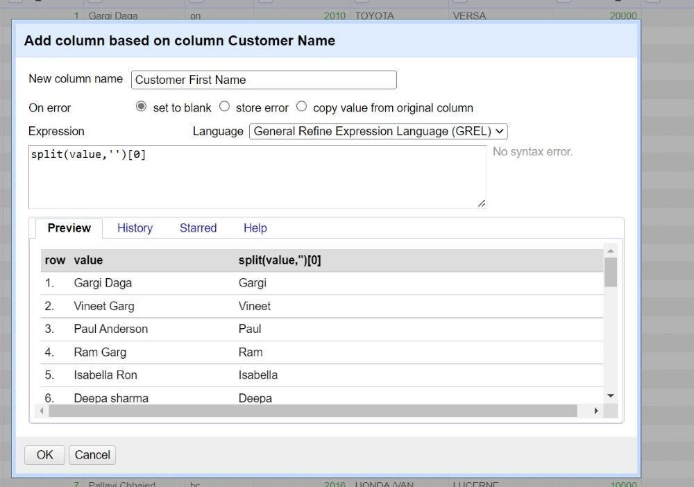
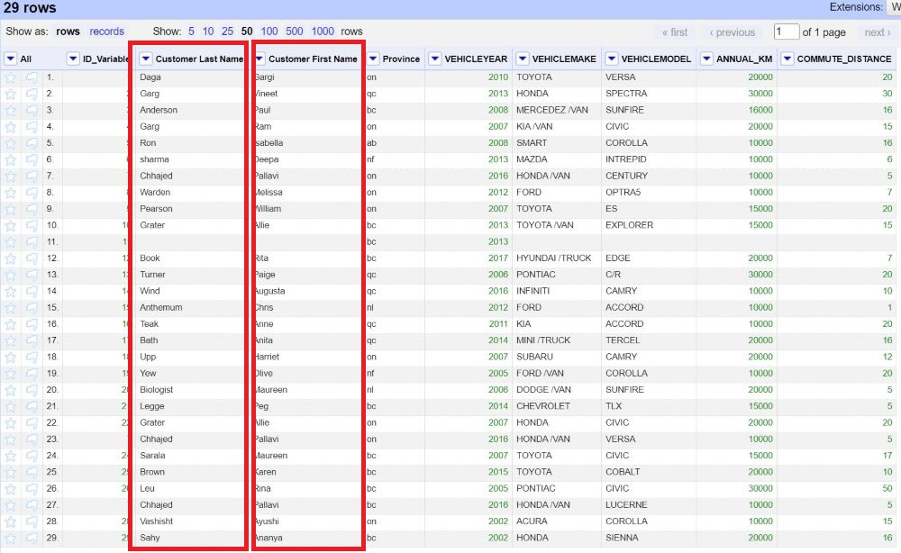

# 1.Introduction to OpenRefine
OpenRefine is an open-source desktop application for data cleanup and transformation to other formats, an activity commonly known as data wrangling. It is similar to spreadsheet applications, and can handle spreadsheet file formats such as CSV, but it behaves more like a database.

----

# 2.Setup Instructions
In preparation for this module, you will need to download and unzip the Open Refine package. The steps to do this are:

* Go to the [downloads page for Open Refine](https://openrefine.org/download.html)
* Click the Highlighted text that represents your operating system (If you are using windows and are unsure if you have java, choose the option that comes with Java)
* Save the file to your computer in a location that you have access to
* Unzip the file using your preferred zipping tool (right click on the folder and choose the program to unzip with like 7zip or WinZip)
(Optional) Make a shortcut on your desktop by opening the folder, right clicking openrefine.exe (blue gem symbol) and clicking "create shortcut" (you may need to move the new shortcut to your desktop manually depending on your operating system)

You will also need to download the dataset for the workshop by clicking [HERE](https://github.com/BrockDSL/Step-by-Step-guide-to-Open-Refine/blob/master/Open%20Refine%20Data%20Set.csv)

----
# 3.What are Data Types?

Data type is an attribute associated with a piece of data that tells a computer system how to interpret its value. Understanding data types ensures that data is collected in the preferred format and the value of each property is as expected. Please click on the headings below to expand the title and know more about the different data types.

<iframe src="https://h5pstudio.ecampusontario.ca/h5p/42564/embed" width="993" height="537" frameborder="0" allowfullscreen="allowfullscreen"></iframe>
----

# 3.1.Take quiz to understand your knowledge of Data Types. 

<iframe src="https://h5pstudio.ecampusontario.ca/h5p/42567/embed" width="993" height="449" frameborder="0" allowfullscreen="allowfullscreen"></iframe>

----
# 4.Now let’s practice cleaning some data.

**Step 1: Create a project**

* In your browser for the OpenRefine tab, choose to create a project from and select “This Computer” under the **Get data from** heading. 
* Choose the file “Open Refine Data Set” that we downloaded during setup instructions and Click on Next. 

* Check the following boxes: “Attempt to parse cell text into numbers” and “Trim leading and trailing whitespace from strings” and click “Create Project”.

* You will see your project has been created. 

**Step 2: Remove Column**

Now we can see that the CSV format data has been converted into a table. But there are columns from the original data that we do not need, for example, the “COMMUTE_DISTANCE” element. We can delete that column by clicking the small triangle at the column name and choosing “Edit column” -> “Remove this column”.

**Step 3: Check duplicates**

* OpenRefine makes it very easy to check duplicates based on columns. Go to the “Customer Name” Column.  
* Click on the small triangle at the column name. Use “Facet” -> “Customized facets” -> “Duplicates facet”, we could see in the left-hand panel, that there are 7 duplicate items ( true)  in the “Customer Name” column. 
* Click on **true** to see the duplicates. 

* We will not be using duplicate data, so click on false. You will see 22 rows. We will be using these 22 rows for our further learning. 

**Step 4: Add columns and split string**

Now we will add another column using the “Customer Name” column. We would extract the first name and last name of the customer. To do that, we use the “General Refine Expression Language (GREL)” to implement splitting. Please follow the below-mentioned procedure to add columns using split string:-

* Go to the “Customer Name” Column. Click on the small triangle at the column name. Use “Edit Column” -> “Add column based on this column”.
* A dialogue box will appear. Under the new column name, type: **Customer First Name**. 
* Make sure, on error is set to blank.
* Under the expression type: <mark> split(value,'')[0]</mark>

* Press “OK”
* You will see the new column name, **Customer First Name** is added right next to the “Customer Name” column. 
* Repeat first 2 procedures, but for the new column name, type: **Customer Last Name**. 
* Under the expression type: <mark> split(value,' ')[1]</mark>

* Press “OK”
* You will see the new column name, **Customer Last Name** is added right next to the “Customer Name” column. 
* Now remove the column “ Customer Name”. 

**Step 5: Common transforms**

* Go to column “Province”, Click on the small triangle at the column name.
* OpenRefine allows for easy transformation by providing a set of functionalities under “Edit cell” -> “Common transforms”.
* Select **to uppercase** to make all the provinces in the capital. 

**Step 6: Delete rows with blank cells**

* We may want to remove the “bad values” or the “outliers”. 
* Go to the “Customer First Name” Column.  
* Click on the small triangle at the column name. Use “Facet” -> “Customized facets” -> “Facet by blank”, we could see a panel on the left-hand side, with a true and false value.  
* Click on **true** to see the rows with empty values. 
* We will not be using the empty data, so click on false. You will see 21 rows. 

**Step 7: Manually edit cell value**

OpenRefine’s automatic data cleaning and transform functionalities have been very useful so far. However, there are still places that need manual editing.

* Go to the column “VEHICLEMAKE”. You will see many values have * TRUCK/VAN* along with its brand, which does not make sense. So, we will manually remove the *TRUCK/VAN* from each cell. 
* We can edit individual cell values by moving the cursor to the cell to be edited and clicking “edit”. Remove TRUCK/VAN and press “Apply”. We do this until every cell is satisfactory.

**Step 8: Exploratory Analysis**

We could use OpenRefine to do some basic exploratory analysis. For example, we are interested in examining the year in which most vehicle belongs. Please follow the steps below for exploratory analysis. 
* Go to the “VEHICLEYEAR” Column. Click on the small triangle at the column name. Use “Sort”
* A dialogue box will appear, select **numbers** under sort cell values as and make sure the smallest first box is checked. 
* Press “OK”
* Go to the “VEHICLEYEAR” Column.  
* Click on the small triangle at the column name. Use “Facet” -> “Numeric Facet” to filter the records.

**Step 9: Export and share**

Finally, we have transformed a CSV format messy data into a nice table. We can export the resulting table into a variety of formats including Excel and use the “Permalink” in the left-upper part to share the workspace with others.

----

# 5.Resources
[Open Refine Manual](https://docs.openrefine.org/): The OpneRefine manual is intended to walk you through every aspect of installing and using OpenRefine 3.5, including every interface function and feature.

----
  
**End notes**
**This module is brought to you by the Brock University Digital Scholarship Lab.  For a listing of our upcoming workshops go to [Experience BU](https://experiencebu.brocku.ca/organization/dsl) if you are a Brock affiliate or [Eventbrite page](https://www.eventbrite.ca/o/brock-university-digital-scholarship-lab-21661627350) for external attendees.  For additional inquiries, contact [DSL@Brocku.ca](mailto:DSL@Brocku.ca)**

